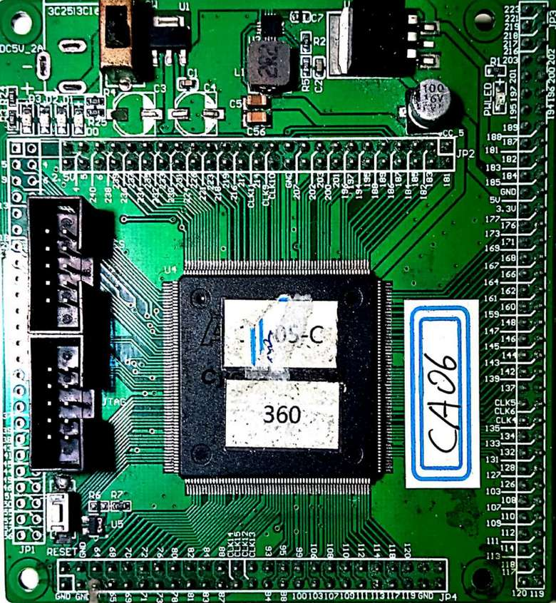
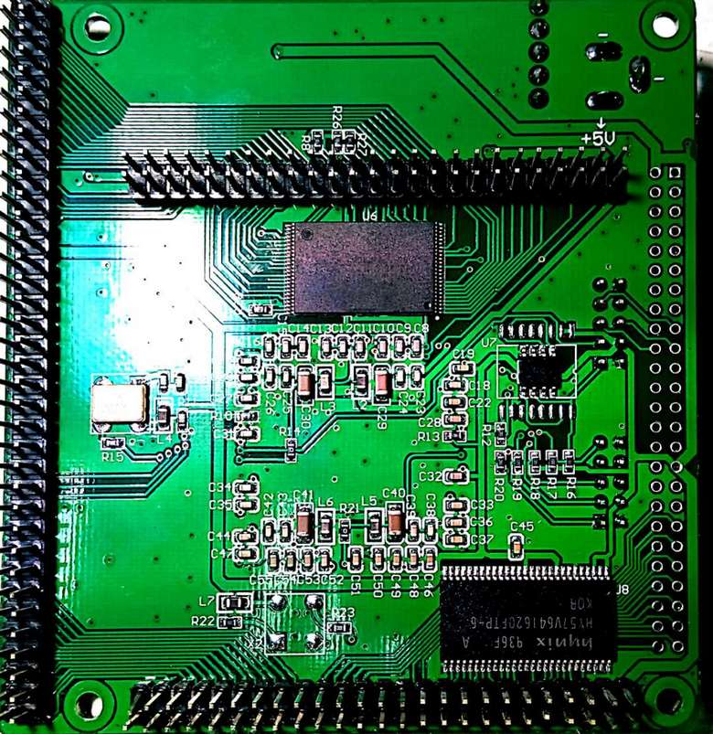

# ZJUNlict Core Board Description
 
 The core board contains the minimum system for an Alter FPGA ([Cyclone III EP3C25](https://www.intel.com/content/www/us/en/products/programmable/fpga/cyclone-iii.html)). (The board is designed using [Altium Designer](https://www.altium.com/altium-designer/) 17.1)

The 2D and 3D design views are shown below:

The main features are:

* Altera EP3C25Q240 FPGA IC as the main chip controls the robot. The firmware can be found in [its repository](https://github.com/ZJUNlict/Firmware_for_Core_Board).
* External 64Mbit SDRAM (HY57V641620) as the memory for Nios II processor created in FPGA.
* External 64Mbit Flash (JS28F640) as the flash for storage.
* 4LEDs indicate hall sensor failure of each driving motor.

The photos of the core board are shown below as references. 

